# Isle

A desktop shell for Hyprland, built in Quickshell. Nothing on screen at
rest but a pill at the top of the display. Everything else, the control
panel, notifications, a dashboard, a launcher, an on-screen keyboard, the
lock screen, Settings, a Monitor and a Keychain, comes out of that one
process when asked and goes away when done. Built for two workloads,
gaming and running coding agents, on CachyOS.


## The island

The pill is the clock, the desktop dots, and a glyph for anything that
has something to say: recording, a muted mic, a VPN, pending updates. It
morphs into whatever is happening, a notification with its actions, the
volume, the track that just started, a drive that was plugged in, an
authentication prompt, and returns to rest.


Hovering unfolds the control panel: Wi-Fi, Bluetooth, notifications,
night light and game mode, the output and its volume, media, the tray,
and a footer with the power profile and the update count. A tray icon's
menu opens as a page of the panel. Apps that quit when their window
closes can be kept in the tray instead (Settings › Apps): closing the
window puts it away, the icon brings it back.

## The dashboard

A grid of widgets on the wallpaper: system, calendar, weather, media,
notifications, clipboard, devices, disks, games, sessions. Every widget
moves, resizes and has its own settings; the System widget's is a small
Grafana, with series, colours, bars, lines or areas, and a legend. Edit
mode is one key. The library is a store: widgets carry an author, a
version and a permission list, and can be installed from any git
registry; writing one is a folder with a manifest and a QML file, see
[docs/WIDGETS.md](docs/WIDGETS.md).

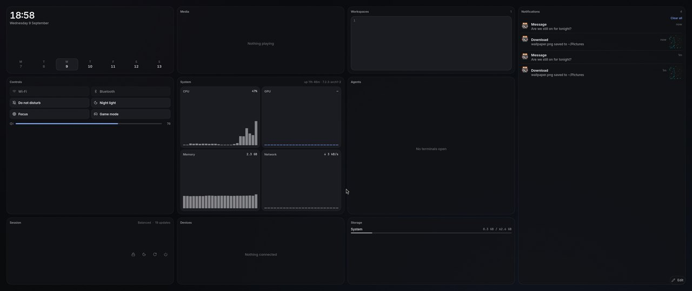
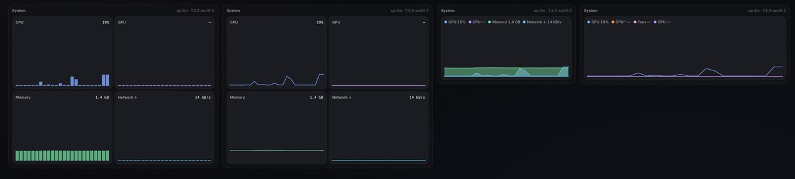

## The launcher

Apps, windows, files, the clipboard, passwords and a calculator, from one
field with a prefix for each. Mission Control spreads the desktop's
windows out, with every desktop in a bar above them, to switch, move or
close.

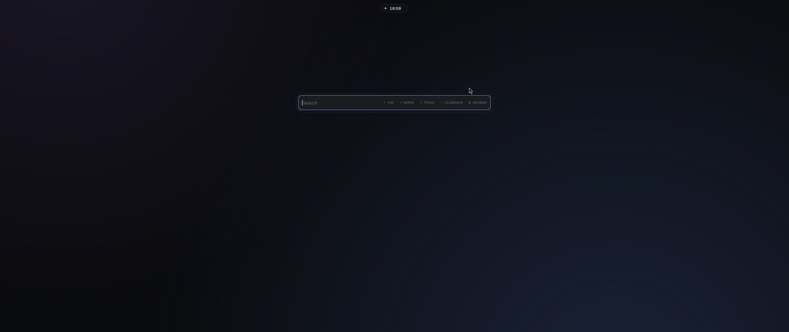
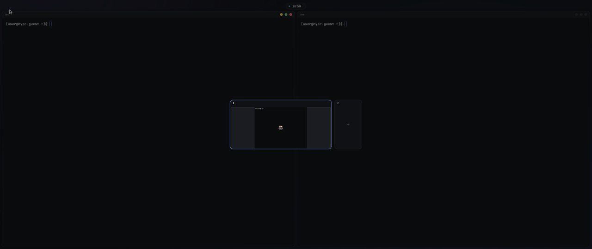

## Settings, Monitor, Keychain

Settings is grouped the way Plasma, macOS and Windows group it and has a
search that jumps to the row. Displays are dragged into place. Appearance
is dark, light, or auto from sunrise to sunset; the installed apps follow,
GTK and Qt alike, Chromium and Electron too, title bars included. Apps
covers defaults, what starts at login, what lives in the tray, and the
services. Updates covers the shell itself and the packages.

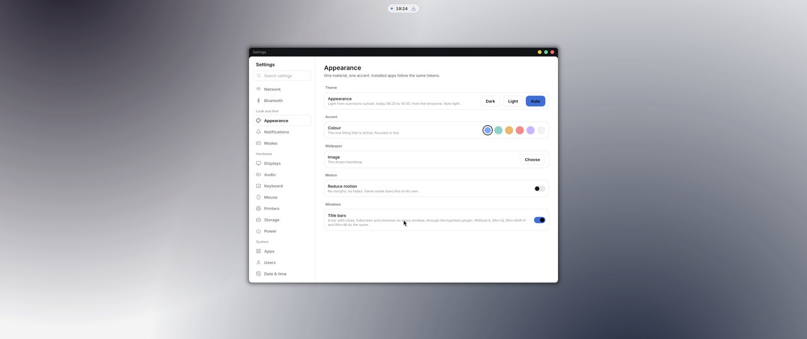

The Monitor is Activity Monitor's shape: CPU, memory, energy, disk,
network and sensors, with the processes grouped under each.

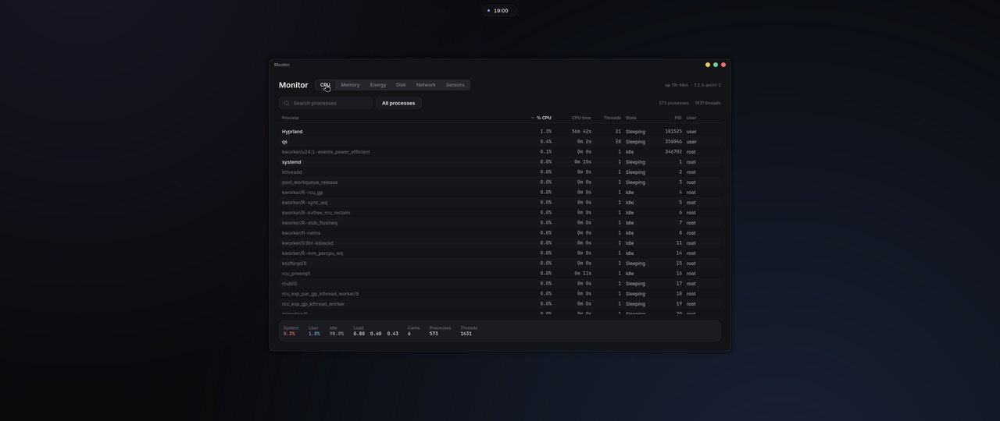

The Keychain is the keyring and the SSH agent in one window: logins, Wi-Fi
and app secrets, and the keys, with a generator and a passphrase prompt.
The keyring unlocks with the login password, at the greeter and at the
lock screen.

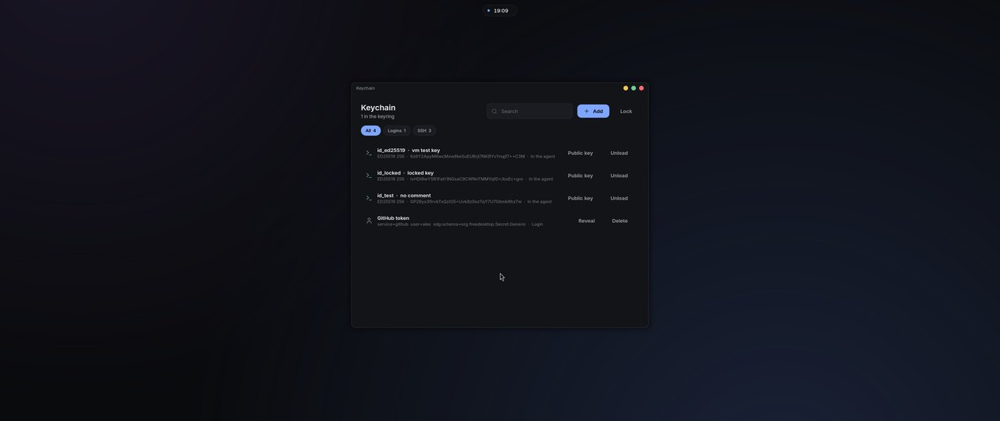

## Modes

Do not disturb holds the notifications. Game mode drops every effect,
turns on VRR and tearing where allowed, and hides the shell until the game
ends. Big Picture is the couch: a home of your games and launchers driven
by the controller, a quick menu on the Guide button, and an on-screen
keyboard with two cursors, one per thumb. Steam's own Big Picture takes
over when it opens and hands back when it closes; Heroic and Lutris get
the pad through a bridge.

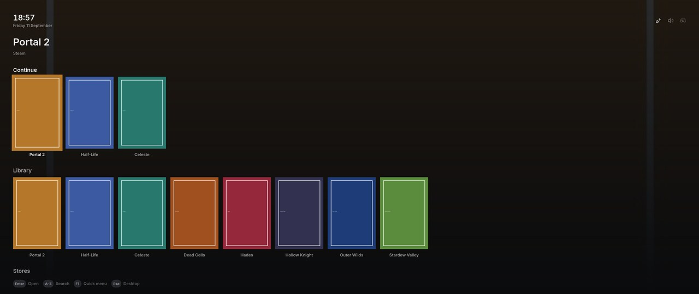
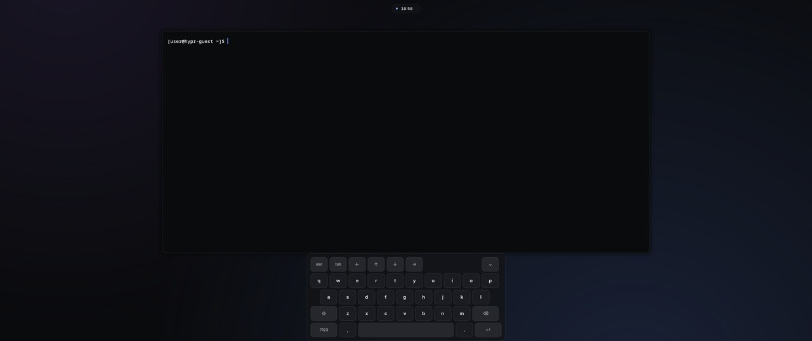
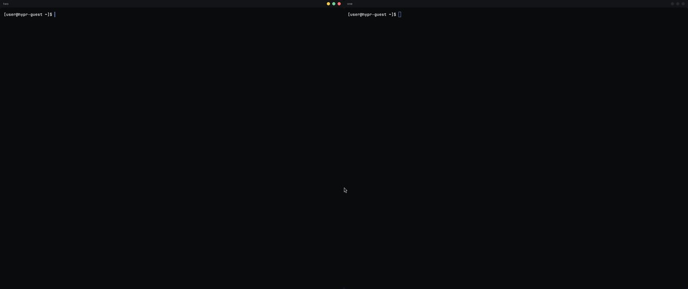

The lock screen and the greeter draw with the same material.


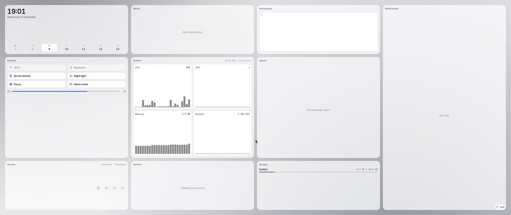

## Install

On CachyOS, as your user:

```bash
curl -fsSL https://raw.githubusercontent.com/alexparlett/isle/main/tools/bootstrap.sh | bash
```

Then log out and pick Hyprland at the login screen. Settings › Updates
keeps the shell current. A fingerprint reader is `tools/fingerprint.sh`:
it installs fprintd and a driver, enrolls a finger, and the lock screen
takes it from the next lock. `tools/tidy.sh` shows what an earlier Isle
installed or wrote that this one no longer uses, and takes it away with
`--yes`.

The desktop runs from `~/.local/share/isle`. To work on it, clone anywhere
else, test in the VM, and run `tools/install.sh` from
that checkout to copy it into place; editing the checkout changes nothing
until then.

## Documents

| | |
|---|---|
| [docs/DESIGN.md](docs/DESIGN.md) | Look and feel: tokens, material, geometry, type, motion, the island, every surface |
| [docs/ARCHITECTURE.md](docs/ARCHITECTURE.md) | Process layout, what drives each capability, the install and ISO paths, the test VM |
| [docs/WIDGETS.md](docs/WIDGETS.md) | Writing a widget: the manifest, the sandbox and `host`, the tools, publishing to a source |
| [docs/STACK.md](docs/STACK.md) | Why Hyprland and Quickshell; the idle budget |
| [docs/DECISIONS.md](docs/DECISIONS.md) | Numbered decisions and why |
| [docs/canvas/](docs/canvas/build.mjs) | The design canvas source |
